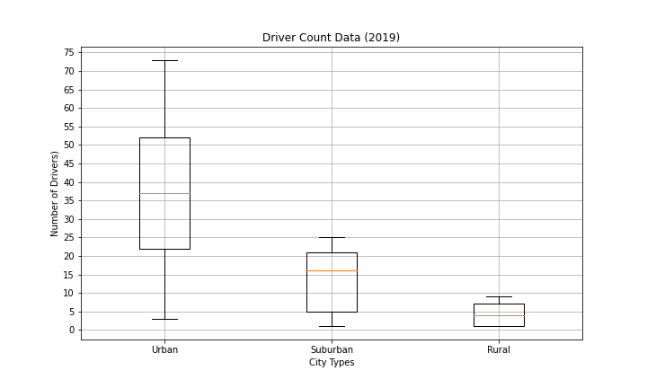
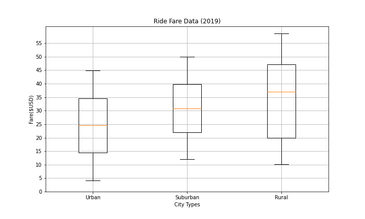

# Analysis of Ride-Sharing Data by City Type

## Overview

## Resources

- Data Sources: *ride_data.csv*, *city_data.csv*
- Software: Python 3.7 (Pandas Library, Matplotlib Library), Anaconda (Jupyter Notebook package), Visual Studio Code 1.38.1

## Results

### Total Rides

### Total Drivers

### Total Fares

### Average Fare per Ride

### Average Fare per Driver

### Total Fare By City Type

## Summary