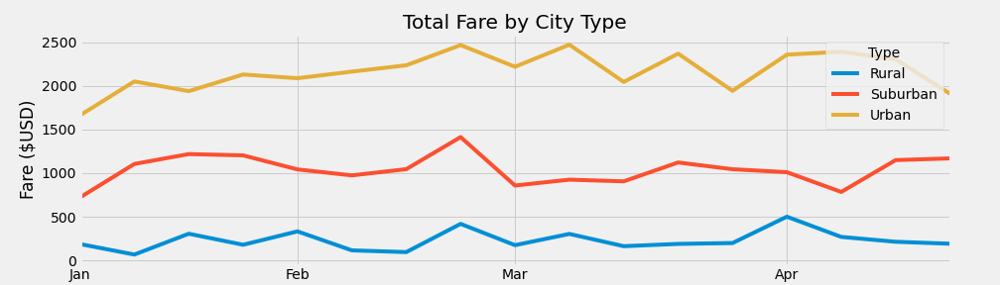

# Analysis of Ride-Sharing Data by City Type

## Overview

The purpose of this analysis was to evaluate a popular ride-sharing service in relation to several different city types (Urban, Rural, and Suburban). To do this, two datasets were obtained and I merged them in to a single comprehensive data frame. Python libraries (Pandas and Matplotlib) were then used to review, clean, format, and then visualize specific data within the data set.

## Resources

- Data Sources: *ride_data.csv*, *city_data.csv*
- Software: Python 3.7 (Pandas Library, Matplotlib Library), Anaconda (Jupyter Notebook package), Visual Studio Code 1.38.1

## Results

### Average Fare per Ride & Driver

As per the above data frame, the data is categorized/grouped by city type. As one might expect, Urban cities have the highest number of rides and drivers and Rural cities have the least. With this, there is a positive correlation with the # of drivers/rides and total fares. However, a negative correlation exists between the # of drivers/rides and average fare per ride and average fare per driver. In other words, Urban cities have the lowest average fare per ride and average fare per driver and Rural cities have the highest fares. This could be due to the low # of drivers in Rural areas which would cause an increase in demand and cost and vice versa for Urban cities. Another possibility is the geography of Urban and Rural cities. The average Urban trip may be much shorter than the average Rural trip. Additional analysis including trip length could prove interesting.

One of the goals of this analysis was to determine any outliers. As the above box and whisker plot shows, the only city type which has an outlier is Urban. The plot shows that Urban cities have an average of approx. 24 trips, however there was one city which had approx. 39 trips, which falls above the upper quartile, thus being an outlier. Suburban and Rural cities did not have any outliers.

As the above plot shows, the average number of drives per city decrease from Urban to Suburban to Rural cities. This plot shows no outliers in the data. The approx. # of average drivers per city per city type are as follows:

- Urban: 37
- Suburban: 16
- Rural: 4

See the below pie chart which further illustrates the disparity between total drivers in the different city types.

### Average Fares

As mentioned earlier, the average fare increases as the number of drivers/rides decreases. The above box and whisker plot supports this. Also, there are no outliers present in the data.

### Total Fare By City Type

The above line plot shows the total fare amount per city type for the months of January through April. As mentioned earlier, Urban cities maintain the highest total fare amount through each month, next are Suburban cities, and lastly, Rural cities. All three city types remain relatively consistent throughout each month. Interestingly, each show a small spike in total fares near the end of February (which could coincide with national holiday - Presidents Day).

## Summary

This analysis shed some light on the extent of the disparity of ride-sharing services offered in Urban, Suburban, and Rural city types. Urban cities have approx. 13x and 2.5x more total rides than Rural and Suburban cities, respectively. In addition, Urban cities have approx. 31x and 5x more drivers than Rural and Suburban cities, respectively. See below for a few possible solutions to decrease the disparity in these numbers.

1. Offer incentives to drivers to work shifts in rural and suburban areas.

2. Partner with local businesses (bars, restaurants, night clubs, golf courses etc) in marketing efforts to increase the need of ride share services to their locations in Suburban and Rural cities.

3. Offer discounts or other incentives to consumers in Rural and Suburban areas who refer a friend/family member who then sign up for the ride share service.
